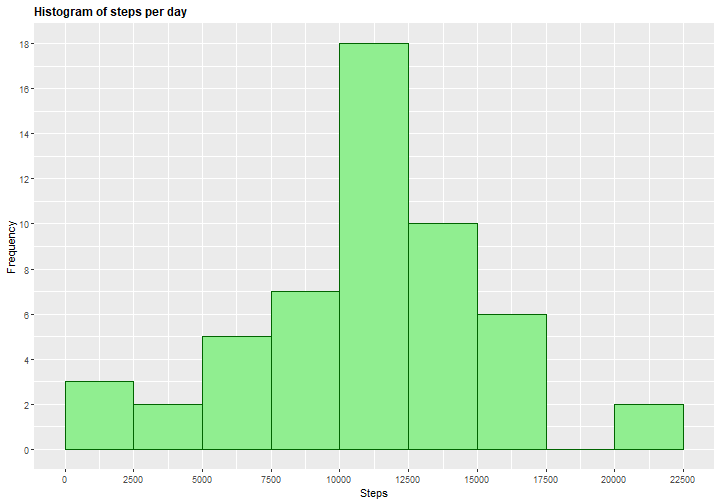
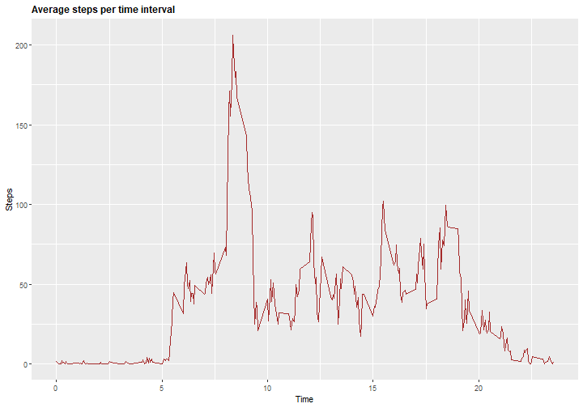
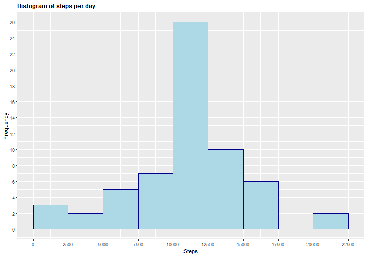
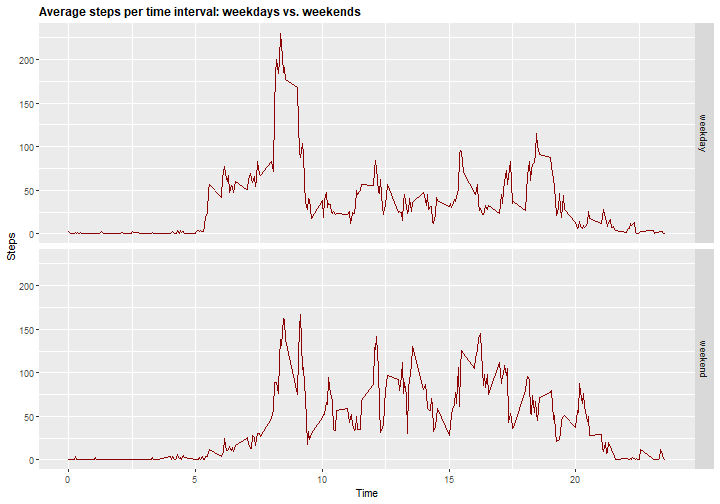

```r
knitr::opts_chunk$set(fig.path='Figs/')
```

###Loading and preprocessing the data
  

```r
# Libraries
library(ggplot2)
library(dplyr)
# Import data
activity <- read.csv("activity.csv")
```

```r
# some information about the variables
str(activity)
```

```
## 'data.frame':	17568 obs. of  3 variables:
##  $ steps   : int  NA NA NA NA NA NA NA NA NA NA ...
##  $ date    : Factor w/ 61 levels "2012-10-01","2012-10-02",..: 1 1 1 1 1 1 1 1 1 1 ...
##  $ interval: int  0 5 10 15 20 25 30 35 40 45 ...
```

As we can see, the variables included in this dataset are:  
1. **steps**: Number of steps taking in a 5-minute interval (missing values are coded as NA)  
2. **date**: The date on which the measurement was taken in YYYY-MM-DD format  
3. **interval**: Identifier for the 5-minute interval in which measurement was taken  

<br>
  
  ###Total number of steps taken per day 
  *For this part of the assignment, you can ignore the missing values in the dataset.*  
  *1. Calculate the total number of steps taken per day*  
  *2. Make a histogram of the total number of steps taken each day*  
  *3. Calculate and report the mean and median total number of steps taken per day*  
  
  **1. Number of steps per day**
  

```r
# create and print number of steps per day
StepsPerDay <- aggregate(activity$steps, list(activity$date), FUN=sum)
colnames(StepsPerDay) <- c("Date", "Steps")
head(StepsPerDay)
```

```
##         Date Steps
## 1 2012-10-01    NA
## 2 2012-10-02   126
## 3 2012-10-03 11352
## 4 2012-10-04 12116
## 5 2012-10-05 13294
## 6 2012-10-06 15420
```


**2. Histogram of the total number of steps taken each day**
  

```r
# draw the histogram
g <- ggplot(StepsPerDay, aes(Steps))
g+geom_histogram(boundary=0, binwidth=2500, col="darkgreen", fill="lightgreen")+ggtitle("Histogram of steps per day")+xlab("Steps")+ylab("Frequency")+theme(plot.title = element_text(face="bold", size=12))+scale_x_continuous(breaks=seq(0,25000,2500))+scale_y_continuous(breaks=seq(0,18,2))
```




**3. Mean and median of total number of steps taken per day**
  

```r
# Mean
mean(StepsPerDay$Steps, na.rm=TRUE)
```

```
## [1] 10766.19
```

```r
# Median
median(StepsPerDay$Steps, na.rm=TRUE)
```

```
## [1] 10765
```

<br>
  
  ###Average daily activity pattern
  *1. Make a time series plot (i.e. type = "l") of the 5-minute interval (x-axis) and the average number of steps taken, averaged across all days (y-axis)*   
  *2. Which 5-minute interval, on average across all the days in the dataset, contains the maximum number of steps?*   
  
  **1. Time series plot of the 5 minute interval (x) and averaged number of steps taken averaged across all days (y)**
  

```r
# create table with steps per time
StepsPerTime <- aggregate(steps~interval,data=activity,FUN=mean,na.action=na.omit)
# variable time (more comprensible for the graph axis)
StepsPerTime$time <- StepsPerTime$interval/100
# Draw the line plot
h <- ggplot(StepsPerTime, aes(time, steps))
h+geom_line(col="brown")+ggtitle("Average steps per time interval")+xlab("Time")+ylab("Steps")+theme(plot.title = element_text(face="bold", size=12))
```



**2. 5-minute interval (on average across all the days) with the maximum number of steps**
  

```r
# table for dplyr
ST <- tbl_df(StepsPerTime)
# find the column
ST %>% select(time, steps) %>% filter(steps==max(ST$steps))
```

```
## # A tibble: 1 x 2
##    time steps
##   <dbl> <dbl>
## 1  8.35  206.
```

<br>
  
  ###Imputing missing values
  *Note that there are a number of days/intervals where there are missing values (coded as NA). The presence of missing days may introduce bias into some calculations or summaries of the data.**  
  **1. Calculate and report the total number of missing values in the dataset (i.e. the total number of rows with NAs)*  
  *2. Devise a strategy for filling in all of the missing values in the dataset. The strategy does not need to be sophisticated. For example, you could use the mean/median for that day, or the mean for that 5-minute interval, etc.*  
  *3. Create a new dataset that is equal to the original dataset but with the missing data filled in.*  
  *4. Make a histogram of the total number of steps taken each day and Calculate and report the mean and median total number of steps taken per day. Do these values differ from the estimates from the first part of the assignment? What is the impact of imputing missing data on the estimates of the total daily number of steps?*   
  
  **1. Total number of missing values in the dataset**
  

```r
# table for dplyr
ACT <- tbl_df(activity)
# find the column
ACT %>% filter(is.na(steps)) %>% summarize(missing_values = n())
```

```
## # A tibble: 1 x 1
##   missing_values
##            <int>
## 1           2304
```

**2. Replace missing values**  
  The rounded values of the average 5-minute interval is used to replace the NA values.  
*CompleteSteps* is the new column without missing values.


```r
# values without NA are imputed in a new column
activity$CompleteSteps <- ifelse(is.na(activity$steps), round(StepsPerTime$steps[match(activity$interval, StepsPerTime$interval)],0), activity$steps)
```

**3. New dataset that is equal to the original dataset but with the missing data filled in**   
  The first ten values of the new dataset are shown below.  


```r
# new dataset activityFull
activityFull <- data.frame(steps=activity$CompleteSteps, interval=activity$interval, date=activity$date)
# see first 10 values of the new dataset
head(activityFull, n=10)
```

```
##    steps interval       date
## 1      2        0 2012-10-01
## 2      0        5 2012-10-01
## 3      0       10 2012-10-01
## 4      0       15 2012-10-01
## 5      0       20 2012-10-01
## 6      2       25 2012-10-01
## 7      1       30 2012-10-01
## 8      1       35 2012-10-01
## 9      0       40 2012-10-01
## 10     1       45 2012-10-01
```

**4A. Histogram of the total number of steps taken each day with missing data filled in**  
  

```r
# prepare data
StepsPerDayFull <- aggregate(activityFull$steps, list(activityFull$date), FUN=sum)
colnames(StepsPerDayFull) <- c("Date", "Steps")
# draw the histogram
g <- ggplot(StepsPerDayFull, aes(Steps))
g+geom_histogram(boundary=0, binwidth=2500, col="darkblue", fill="lightblue")+ggtitle("Histogram of steps per day")+xlab("Steps")+ylab("Frequency")+theme(plot.title = element_text(face="bold", size=12))+scale_x_continuous(breaks=seq(0,25000,2500))+scale_y_continuous(breaks=seq(0,26,2))
```



**4B. Calculate and report the mean and median total number of steps taken per day. Do these values differ from the estimates from the first part of the assignment? What is the impact of imputing missing data on the estimates of the total daily number of steps?**  
  

```r
# Mean
mean(StepsPerDayFull$Steps)
```

```
## [1] 10765.64
```

```r
#Median
median(StepsPerDayFull$Steps)
```

```
## [1] 10762
```

Imputing missing data have only a little and transcurable impact on the mean ant the median of the total daily number of steps.
Watching the histogram we can note than the only bin that is changed is the interval between 10000 and 12500 steps, grown from a frequency of 18 to a frequency of 26.
Different methods for replace missing values could cause different results.

<br>
  
  ###Are there differences in activity patterns between weekdays and weekends?
  *For this part the weekdays() function may be of some help here. Use the dataset with the filled-in missing values for this part.*  
  *1. Create a new factor variable in the dataset with two levels - "weekday" and "weekend" indicating whether a given date is a weekday or weekend day.*  
  *2. Make a panel plot containing a time series plot (i.e. type = "l") of the 5-minute interval (x-axis) and the average number of steps taken, averaged across all weekday days or weekend days (y-axis).*  
  
  **1. Create a new factor variable in the dataset with two levels - "weekday" and "weekend" indicating whether a given date is a weekday or weekend day.**  
  *DayType* is the new column indicating if the day is a weekday day or a weekend day: the first ten values of the new table are shown below


```r
# Create variable with date in correct format
activityFull$RealDate <- as.Date(activityFull$date, format = "%Y-%m-%d")
# create a variable with weekdays name
activityFull$weekday <- weekdays(activityFull$RealDate)
# create a new variable indicating weekday or weekend
activityFull$DayType <- ifelse(activityFull$weekday=='Saturday' | activityFull$weekday=='Sunday', 'weekend','weekday')
# see first 10 values
head(activityFull, n=10)
```

```
##    steps interval       date   RealDate weekday DayType
## 1      2        0 2012-10-01 2012-10-01  Monday weekday
## 2      0        5 2012-10-01 2012-10-01  Monday weekday
## 3      0       10 2012-10-01 2012-10-01  Monday weekday
## 4      0       15 2012-10-01 2012-10-01  Monday weekday
## 5      0       20 2012-10-01 2012-10-01  Monday weekday
## 6      2       25 2012-10-01 2012-10-01  Monday weekday
## 7      1       30 2012-10-01 2012-10-01  Monday weekday
## 8      1       35 2012-10-01 2012-10-01  Monday weekday
## 9      0       40 2012-10-01 2012-10-01  Monday weekday
## 10     1       45 2012-10-01 2012-10-01  Monday weekday
```

**2. Two time series plot of the 5-minute interval (x) and the average number of steps taken averaged across weekday days or weekend days (y).**  
  

```r
# create table with steps per time across weekdaydays or weekend days
StepsPerTimeDT <- aggregate(steps~interval+DayType,data=activityFull,FUN=mean,na.action=na.omit)
# variable time (more comprensible for the graph axis)
StepsPerTimeDT$time <- StepsPerTime$interval/100
# draw the line plot
j <- ggplot(StepsPerTimeDT, aes(time, steps))
j+geom_line(col="darkred")+ggtitle("Average steps per time interval: weekdays vs. weekends")+xlab("Time")+ylab("Steps")+theme(plot.title = element_text(face="bold", size=12))+facet_grid(DayType ~ .)
```


